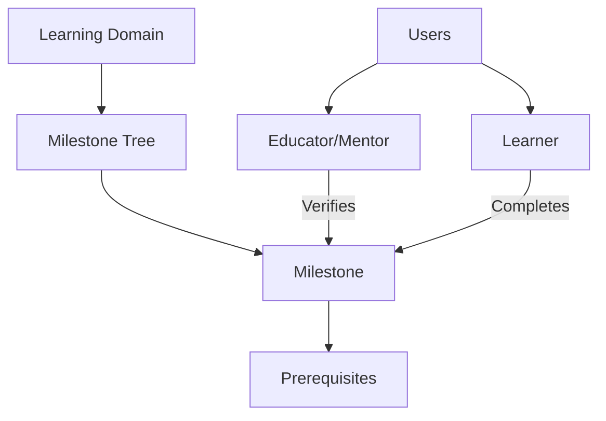

# Connect Toolkit: Learning Milestone Tracker

A blockchain-powered platform for tracking and verifying educational milestones, creating transparent and immutable learning journeys.

## Overview

Connect Toolkit is a decentralized system designed to empower learners, educators, and parents by providing a transparent, verifiable method of tracking educational achievements. By leveraging blockchain technology, we create an immutable record of learning progress that can be trusted and shared across networks.

### Key Features
- Decentralized learning milestone tracking
- Transparent achievement verification
- Multi-stakeholder collaboration
- Flexible learning path creation
- Prerequisite-driven progression
- Immutable achievement records

## Architecture

The Connect Toolkit system uses a smart contract to manage users, relationships, and learning milestones organized in hierarchical structures.



### Core Components
- **Users**: Multi-role system (Admin, Educator, Parent, Learner)
- **Domains**: Collections of related milestone trees
- **Milestones**: Granular learning achievements
- **Relationships**: Mentor-learner connections
- **Completions**: Verified learning records

## Contract Documentation

### connect-learning.clar
The core smart contract managing the Connect Toolkit platform.

#### Key Features
- Flexible user role management
- Dynamic milestone creation
- Relationship-based permissions
- Verifiable achievement tracking

## Getting Started

### Prerequisites
- Clarinet
- Stacks blockchain wallet
- Clarity development environment

### Basic Usage

1. Register a user:
```clarity
(contract-call? .connect-learning register-user "Alice Johnson" u2)
```

2. Create a learning domain:
```clarity
(contract-call? .connect-learning create-forest "Computer Science" "Tech skills pathway")
```

3. Create a milestone:
```clarity
(contract-call? .connect-learning create-milestone 
    "Programming Fundamentals" 
    "Learn basic programming concepts" 
    "Software Development" 
    u1 
    u1 
    none)
```

## Development

### Testing
1. Clone repository
2. Install Clarinet
3. Run `clarinet test`
4. Use `clarinet console` for interaction

### Local Development
1. Setup local Clarinet chain
2. Deploy using `clarinet deploy`
3. Interact via console or API

## Security Considerations

### Access Control
- Role-based permissions
- Verified relationship requirements
- Immutable milestone tracking

### Best Practices
- Verify user relationships
- Provide completion evidence
- Follow structured learning paths
- Conduct regular audits# Connect Toolkit: Learning Milestone Tracker

A blockchain-powered platform for tracking and verifying educational milestones, creating transparent and immutable learning journeys.

## Overview

Connect Toolkit is a decentralized system designed to empower learners, educators, and parents by providing a transparent, verifiable method of tracking educational achievements. By leveraging blockchain technology, we create an immutable record of learning progress that can be trusted and shared across networks.

### Key Features
- Decentralized learning milestone tracking
- Transparent achievement verification
- Multi-stakeholder collaboration
- Flexible learning path creation
- Prerequisite-driven progression
- Immutable achievement records

## Architecture

The Connect Toolkit system uses a smart contract to manage users, relationships, and learning milestones organized in hierarchical structures.


### Core Components
- **Users**: Multi-role system (Admin, Educator, Parent, Learner)
- **Domains**: Collections of related milestone trees
- **Milestones**: Granular learning achievements
- **Relationships**: Mentor-learner connections
- **Completions**: Verified learning records

## Contract Documentation

### connect-learning.clar
The core smart contract managing the Connect Toolkit platform.

#### Key Features
- Flexible user role management
- Dynamic milestone creation
- Relationship-based permissions
- Verifiable achievement tracking

## Getting Started

### Prerequisites
- Clarinet
- Stacks blockchain wallet
- Clarity development environment

### Basic Usage

1. Register a user:
```clarity
(contract-call? .connect-learning register-user "Alice Johnson" u2)
```

2. Create a learning domain:
```clarity
(contract-call? .connect-learning create-forest "Computer Science" "Tech skills pathway")
```

3. Create a milestone:
```clarity
(contract-call? .connect-learning create-milestone 
    "Programming Fundamentals" 
    "Learn basic programming concepts" 
    "Software Development" 
    u1 
    u1 
    none)
```

## Development

### Testing
1. Clone repository
2. Install Clarinet
3. Run `clarinet test`
4. Use `clarinet console` for interaction

### Local Development
1. Setup local Clarinet chain
2. Deploy using `clarinet deploy`
3. Interact via console or API

## Security Considerations

### Access Control
- Role-based permissions
- Verified relationship requirements
- Immutable milestone tracking

### Best Practices
- Verify user relationships
- Provide completion evidence
- Follow structured learning paths
- Conduct regular audits